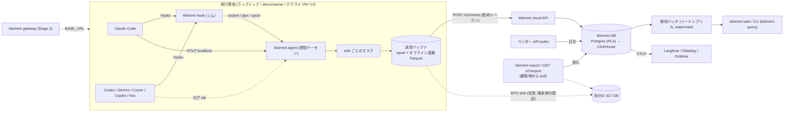

# kikimimi アーキテクチャ設計書 (v0.3)

作成: 2026-08-30 (v0.1: 2026-08-28, v0.2: 2026-08-30)
前提調査:
(前提調査ドキュメントは非公開の internal/ に保管)

## 0. 変更履歴

| 版 | 変更 | 理由 |
|---|---|---|
| v0.1 → v0.2 | OS 層透過プロキシ (NE / WinDivert / eBPF) → **各エージェントの hooks / OTel / セッションログ** を常駐デーモンが受け取る。中核価値を「可視化 + ブロック」から「チーム横断の可視化 + 苦戦検知 → MCP/スキル改善ループ」へ。遮断はベストエフォート、ハード上限は Stage 2 のゲートウェイ | エージェントは VM・コンテナ・クラウドサンドボックスで動き、ホスト OS 層では見えない/帰属できない。ブロックは VM 内 root に成立しない |
| v0.2 → v0.3 | 保存先を「顧客の S3 (BYOB) が正」から **guru cloud (guru が持つ DB + API) が正、オプションで自分の S3 / DB にも同時書き込み (BYO sink)** へ。ローカル Parquet は必須からオフライン用バッファへ | 複数マシン・チームで「すぐ使える」ことを優先。バケット作成 + IAM + キー配布はセルフサーブの導入障壁として大きすぎる。代わりにデータは guru 側に置かれるので、ロックインと信頼の手当て (§11) を設計要件に格上げする |
| v0.3 → v0.3 (rename) | プロダクト名を **guru → kikimimi** に変更 (パッケージ名・バイナリ名・env プレフィクス・cookie 名・スキーマバージョン `guru.v1` → `kikimimi.v1` 等、リポジトリ全体)。本ドキュメントも本節を除き全面的に置換済み | ブランド変更 (詳細は社内のみ) |

## 1. 目的とスコープ

**kikimimi** は、チーム/会社の AI コーディングエージェント利用を **ネットワーク横取りなし・エージェントの純正機構だけで** 収集し、
(1) 誰が・どのエージェント/モデルで・何トークン/いくら使っているかをチーム横断で見せ、
(2) **エージェントが MCP を迂回した瞬間 (使えるはずの MCP ツールが使われず Bash / Playwright に逃げた) をエージェント側から検知し**、リトライの連鎖や使われない MCP サーバーと合わせて、**MCP サーバー / スキル / ツールの改善バックログ** に変えるツール。

差別化の言い方 (競合調査 [competitor-landscape.md](../research/competitor-landscape.md) の結論): 「MCP サーバー単位のランキング」や「改善ループ」は Zuplo / Speakeasy Gram / Spanly が部分的に持っている。**MCP ゲートウェイ勢は MCP プロトコル境界の外 (Bash / Playwright) を構造的に見られず、評価ベンダー (Galileo / Arize) は「呼んだツールが正しいか」までで「呼ばれなかった利用可能ツール」を扱わない。** kikimimi の一文目は「エージェントが MCP を迂回した瞬間を、エージェント側から検知する」にする。

### 1.1 代表ユースケース

1. チームが社内サービスの MCP サーバーとスキルを整備し、エージェントに渡している
2. あるタスクで、エージェントは MCP で取れるはずのデータを Playwright でスクレイプして完了させた。本人は後から履歴を辿って初めて気づく
3. kikimimi はこの「MCP ツールの失敗/未使用 → ブラウザ/シェルでの代替」を検知し、同じ MCP サーバーで繰り返し起きていることをチーム横断のランキングで示す
4. プラットフォームチームが MCP 側にツールを足す / 説明を直す
5. 翌週、同じパターンの発生率が下がったことを同じ画面で確認する

コスト可視化はこのループを見てもらうための入口であり、本命はループの方。

**X 一次調査 (2026-08-31, [x-primary-voices.md](../research/x-primary-voices.md)) による補正**: 「こっそり迂回を後から発見」という一次証言は見つからなかった。実態は **パワーユーザーが文脈税 (ツールスキーマの固定費) と auth を理由に MCP を意図的に捨てて curl / CLI / Playwright に寄せている**。よって kikimimi の売り方は「迂回の警察」ではなく **「MCP 経由 vs 代替手段の比率と、ツールスキーマの固定費を計測し、『MCP を直すか・CLI に寄せるか』をデータで決めさせる計測器」** とする。入口として最も強く立ったのは「複数マシン合算」(ccusage は 1 マシン限定で、自作・改修する人が多数)。

| 対象 | 例 | やること |
|---|---|---|
| CLI / IDE エージェント | Claude Code, Codex CLI, Gemini CLI, Cursor, Copilot CLI, Kiro | hooks / OTel / セッションログの収集、正規化、集計、苦戦検知 |
| 実行環境 | ラップトップ (macOS / Linux / Windows)、devcontainer、Codespaces、クラウド VM、CI ランナー、使い捨て VM | 同じ単一バイナリを同じアカウントで常駐させ、同じ場所に集める |
| 利用者 | **個人開発者** (複数マシンの自分の利用と苦戦パターン)、プラットフォーム/開発者体験チーム、チームリード、FinOps | CLI、Web ダッシュボード、API、改善提案 |

**v0.x の非スコープ**: Web チャット (ChatGPT / claude.ai) の監視、ネットワーク層の遮断、Aider のような hooks/MCP を持たないツール、通信内容の復号。

## 2. 設計原則

1. **エージェント純正のデータ源を使う**: hooks / OpenTelemetry export / セッションログを主とし、足りない分 (Cursor のトークン等) はベンダーの Admin / Analytics API で補完する。TLS 終端・LD_PRELOAD・eBPF はやらない
2. **エージェントを絶対に止めない (fail-open)**: hook シムは即座に return する (デーモンへの通知は数十 ms のタイムアウト付きノンブロッキング)。デーモン不在・オフラインでもエージェントは動く
3. **すぐ使える・どのマシンでも同じ**: `kikimimi login` だけで複数マシンのデータが 1 つのアカウントに集まる。バケットや DB の用意を要求しない。**初回インサイトまで 2 分以内・3 コマンド以内、root 不要、`kikimimi uninstall` 1 コマンドで完全に元に戻る** を製品要件にする (Observal は Docker Compose 10 サービスの自己ホスト、agentsview はホスト型同期が未実装で、個人・小規模チームが「すぐ試す」入口は空いている)
4. **預かる代わりに、実害を出さない**: v0.2 の「データは顧客側」から後退し、既定でメタデータが kikimimi cloud に置かれる。その代わり (a) メタデータのみ既定、本文は既定で cloud に送らない、(b) いつでも全量エクスポート (Stage 0 から)、(c) 同じスキーマで自分の S3 / DB にも同時書き込み (BYO sink)、(d) 将来は self-hosted、(e) 事業終了時の猶予とエスクロー (§11) を約束する。BYO sink の認証情報は端末に留め、kikimimi cloud には送らない
5. **メタデータのみがデフォルト**: プロンプト本文・ツール引数の本文はオプトイン。方針は OTel GenAI semconv (`gen_ai.input.messages` 等は Opt-In) と Claude Code 自身の `OTEL_LOG_*` フラグに揃える
6. **監視を秘匿しない・検証可能にする**: `kikimimi status` で収集内容と送信先を常に確認できる。収集コード (シム / デーモン / スキーマ / アダプタ / sink) は OSS にし、「メタデータのみ」をクライアント側はコードで示す。**cloud 側の運用は第三者検証が整うまで自己申告に留まる** ことを認め、受領ログの突合 (§11) で埋める
7. **欠損を隠さない**: 取れない数字は推定で埋めず `unknown` として集計に併記する。重複排除で落としたイベント数も可視化する
8. **ephemeral 前提**: ホストは使い捨てられる。バッファは短く、テアダウン時に送信を試み、失敗したら欠損として可視化する。cloud への認証は短命トークンのみ。**BYO sink を ephemeral 環境で使う場合も OIDC / 一時クレデンシャルに限り、長期キーの焼き込みは禁止**
9. **スキーマは固定版を自前で持つ**: OTel GenAI / MCP semconv の命名に寄せるが、上流の破壊的変更から緩衝する。cloud の DB、BYO sink の Parquet、エクスポートはすべて同じ `kikimimi.v1`
10. **目的限定**: 集計の主語は MCP サーバー / スキル / ツール。個人ランキングや人事評価への転用は既定で禁止 (§11)

## 3. 全体像



**1 バイナリ・1 スキーマ・1 アカウント。** デーモンは収集・正規化・sink ごとのマスク・送信に徹し、判定 (苦戦検知) と集計は kikimimi cloud 側で行う。エクスポートは常に顧客側からの pull で、cloud は顧客のストレージへの書き込み権限を持たない。

## 4. kikimimi agent (常駐デーモン)

| 構成要素 | 役割 |
|---|---|
| **hook シム** (`kikimimi hook <event>`) | 各エージェントの hooks 設定から呼ばれる。stdin の JSON を **1 呼び出し 1 ファイル + atomic rename** でローカル spool に書き、デーモンの unix socket (Windows は named pipe) に **50 ms タイムアウトのノンブロッキング接続** で通知して即 exit 0。接続できなければ諦めて exit 0 (stale なソケットで待たされない)。判定は一切しない (fail-open)。spool 方式なので並列サブエージェント・複数セッションの同時書き込みで衝突せず、デーモンは処理済みファイルを削除して冪等性を担保する。プロセス起動は 1 ツール呼び出しごとに発生する (1 セッション数百回) ため、シムは依存なしの最小バイナリにし、**p99 レイテンシを Stage 0 で実測**する。SessionEnd は全 hooks 合計 1.5 秒の共有予算 (既定) なので spool 書き込みだけで返し、送信はここでは行わない |
| **OTLP レシーバ** | 既定 `localhost:4318` (HTTP) / `4317` (gRPC) で Claude Code / Codex / Gemini CLI の OTel export を受ける。トークン・コスト・モデル・`tool_result` はここから来る。`kikimimi init` はポート使用状況を検査し、衝突時は別ポートを選んで **影響する全エージェント設定を一括更新** する (静的に書き込む方式なので個別対応は不可)。認証あり **(per-install bearer token, `OTEL_EXPORTER_OTLP_HEADERS`)** — `127.0.0.1` はこのマシン上のどのプロセスからも到達できるため、トークン無しだと偽イベントを本物のセッションのものとして記録させられてしまう (§11 の信頼性前提)。トークン未設定 (`init` 前) は fail-open |
| **ログ tailer** | hooks に無い情報の補完。Codex の `~/.codex/sessions` rollout JSONL、Gemini CLI の `--telemetry-outfile`、Copilot の `~/.copilot`。Claude Code の transcript JSONL は **補助のみ** (Anthropic が「内部形式・契約ではない」と明言、無告知ドリフト有り)。この Claude Code transcript は daemon 起動時に一度だけ `~/.claude/projects/**/*.jsonl` を一括バックフィルもする — hooks/OTel 収集が始まる**前**に終わっていたセッションだけが対象 (boundary = ローカル Parquet の最古 `dt`、無ければ初回起動時刻。それ以降のセッションは hooks/OTel と二重計上になり得るため対象外) |
| **正規化** | エージェント別アダプタが §5 の共通スキーマへ変換。hooks と OTel の相関は **Claude Code のみ `tool_use_id` の一致が公式保証**。他エージェントは Stage 0/1 で実証するまで **hook 行と OTel/ログ行を別行のまま保持** し、無理に結合しない。`event_id` = hash(`host_id`, `source`, `event_type`, 一次キー) で端末側が決定的に生成する。一次キーは `tool_use_id` があればそれ、無ければ `session_id` + 端末側の連番 (§5.1 の対応表)。`host_id` はデーモン初回起動時にランダム UUID を採番してローカルに永続化する (machine-id や MAC は使わない。ゴールデンイメージにこのファイルを焼き込まないよう配布ドキュメントで注意) |
| **sink ごとのマスク** | 正規化済みイベントを sink に渡す前に、**sink ごとの本文ポリシー** を適用する。`cloud` sink は組織設定に従い `args` / `content` 列を常に NULL 化 (オプトイン時のみ `args` を端末側でマスクして送る)。BYO sink はフル本文を受け取れる。単純な fan-out にしない (本文が cloud に漏れる経路を作らない) |
| **送信バッファ** | マスク済みイベントをローカルにキューし、**N 件 / T 秒 / SessionEnd / SIGTERM** でバッチ送信。オフライン・cloud 障害時はローカル Parquet に退避して再送 (指数バックオフ、サーバーの 429 + `Retry-After` に従う、上限 `local.max_size`)。再送順序は保証しない (cloud 側は `ts` で並べ、検知は watermark 方式 §7.2)。ephemeral 環境は短周期 |
| **sink (出口)** | プラグイン式。`cloud` (既定、`POST /v1/events`)、`s3` (自分のバケットへ `kikimimi.v1` Parquet)、`file` (ローカル Parquet のみ = オフライン/エアギャップ用)。複数同時に有効化でき、同じ列定義で書く (本文の有無は上のマスクで sink ごとに変わる)。BYO sink の認証情報は端末の設定にだけ置く。`kikimimi flush` で明示送信 (CI の post step 用)。`kikimimi compact` (BYO sink の小ファイル結合) は Stage 1 |
| **セットアップ** (`kikimimi login` / `kikimimi init`) | `kikimimi login`: ブラウザのデバイス認証でアカウントに紐づけ、短命デバイストークン (自動更新) を保存 (§6 の保存先)。`kikimimi init`: 検出したエージェントの設定に hooks / OTel export を書き込む。個人: user 設定。組織の managed 設定の配布は Stage 2 (§9) |
| **組織設定の取得** | 本文オプトイン・BYO sink・保持期間などの組織設定は起動時に取得し、**稼働中も 5 分ごとにポーリング** (プライバシー側の変更は即時反映)。取得に失敗したら安全側 = 本文 OFF にフォールバック |
| **状態表示** (`kikimimi status`) | 収集対象・本文オプトインの有無・有効な sink と送信先・直近の件数・未送信数・重複排除で落とされた件数を表示。**ヘルスチェック**: hooks は届いているのに OTel が皆無 (Windows で OTel が無音で失敗する既知バグ [#46204](https://github.com/anthropics/claude-code/issues/46204))、送信失敗の継続、spool 滞留を警告する |

**ベンダー API puller** (kikimimi cloud 側の日次ジョブ): Anthropic Claude Code Analytics API (ユーザー×日×モデルのトークン/コスト総量。サブエージェント単位の内訳は無いので #83430 の欠損は埋まらない)、Cursor Admin API `filtered-usage-events`、GitHub Copilot Metrics API、Kiro 管理 CSV。組織がベンダー API キーを kikimimi cloud に登録した場合のみ動く。**ローカルイベントと確定キーで結合できない** ため、`timestamp 近傍 + user + model` のファジー結合で `usage_source = vendor_api` として付与し、結合できなければ別テーブルのまま集計に使う。

### 4.1 エージェント別アダプタ

| エージェント | ツール呼び出し (名前・入力・所要時間・成否) | トークン / モデル | 識別 | 組織強制 |
|---|---|---|---|---|
| Claude Code | hooks (`PreToolUse` / `PostToolUse` / `PostToolUseFailure` / `PermissionDenied` / `SubagentStop` …、MCP は `mcp__<server>__<tool>`) | OTel `claude_code.token.usage`, `cost.usage`, `tool_result`, `api_request`。hooks には無い (サブエージェント `tool_response.usage` のみ例外) | OTel `user.email` (**OAuth 認証時のみ**)、`organization.id`, `session.id`; hooks `session_id` | ○ 確認済み: managed-settings.json の hooks は `disableAllHooks` で無効化不可、`allowManagedHooksOnly` |
| Codex CLI | hooks (Claude Code 互換) + rollout JSONL (`McpToolCallBegin/End`, `ExecCommandBegin/End`) | rollout `TokenCount` / `[otel]` export | OTel `account_email`, `session_id` | ○ 確認済み: `requirements.toml` `allow_managed_hooks_only` |
| Gemini CLI | hooks (`BeforeTool` / `AfterTool` …) + OTel `gemini_cli.tool_call` (`function_args`, `duration_ms`, `success`) | OTel `gemini_cli.token.usage` | `user.email`, `session.id` | △ **未検証** (hooks の優先順位がドキュメント内で矛盾) |
| Cursor | hooks (`preToolUse` / `beforeMCPExecution` / `afterFileEdit` / `stop`、全イベントに `model`, `user_email`, `transcript_path`) | hooks の `model`; トークンは Admin API `filtered-usage-events` (`timestamp`, `userEmail`, `model`, `tokenUsage`; **conversation_id は無い** → ファジー結合) | hooks `user_email`, `conversation_id` | ○ 確認済み: Enterprise (MDM) > Team > Project > User |
| Copilot CLI | hooks (`toolName` / `toolArgs`) + `~/.copilot/session-store.db` | hooks に無し。Metrics API は集計のみ | hooks は `session_id` のみ。**user_id はローカルでは取れない** (Metrics API / 監査ログで補完、無ければ unknown) | ○ 確認済み: `/etc/github-copilot/policy.d/` (ユーザー変更不可) |
| Kiro | hooks (`.kiro/hooks/`) | 管理 CSV はメッセージ数のみ (トークン無し) | hooks のペイロードは未確認。`User_Email` は **管理 CSV 側**にしか無い | ✕ 未文書化 |

ホスト型では **kikimimi アカウント (`kikimimi login`) がユーザー識別の正**になり、エージェント側の `user.email` は補助になる。これにより Copilot / OAuth でない Claude Code でも user_id が埋まる (端末単位の紐づけなので、共有マシンでは組織側で運用ルールが要る。CI は組織トークンでジョブ単位に属性付け)。

**既知の欠損** (`usage_source = unknown` として扱い、推定値で埋めない):
- Claude Code: サブエージェント単位のコスト属性が OTel で出ない ([#83430](https://github.com/anthropics/claude-code/issues/83430))、LiteLLM 経由の非 Anthropic モデルは `usage` が空 ([#88107](https://github.com/anthropics/claude-code/issues/88107))、Windows の managed アカウントで OTel が無音で初期化失敗 ([#46204](https://github.com/anthropics/claude-code/issues/46204))
- Cursor: トークンは Admin API 依存 (Team/Enterprise 契約が前提)
- Copilot / Kiro: ターン単位のトークンが取れない

### 4.2 hooks 設定の書き込み例 (Claude Code)

```json
{
  "hooks": {
    "PreToolUse":  [{ "hooks": [{ "type": "command", "command": "kikimimi hook PreToolUse",  "timeout": 5 }] }],
    "PostToolUse": [{ "hooks": [{ "type": "command", "command": "kikimimi hook PostToolUse", "timeout": 5 }] }],
    "PostToolUseFailure": [{ "hooks": [{ "type": "command", "command": "kikimimi hook PostToolUseFailure", "timeout": 5 }] }],
    "PermissionDenied":   [{ "hooks": [{ "type": "command", "command": "kikimimi hook PermissionDenied", "timeout": 5 }] }],
    "SubagentStop": [{ "hooks": [{ "type": "command", "command": "kikimimi hook SubagentStop", "timeout": 5 }] }],
    "SessionStart": [{ "hooks": [{ "type": "command", "command": "kikimimi hook SessionStart", "timeout": 5 }] }],
    "SessionEnd":   [{ "hooks": [{ "type": "command", "command": "kikimimi hook SessionEnd",   "timeout": 1 }] }]
  },
  "env": {
    "CLAUDE_CODE_ENABLE_TELEMETRY": "1",
    "OTEL_METRICS_EXPORTER": "otlp",
    "OTEL_LOGS_EXPORTER": "otlp",
    "OTEL_EXPORTER_OTLP_PROTOCOL": "http/protobuf",
    "OTEL_EXPORTER_OTLP_ENDPOINT": "http://localhost:4318"
  }
}
```

`OTEL_LOG_TOOL_DETAILS` / `OTEL_LOG_USER_PROMPTS` は書かない (本文はオプトイン、§5.2)。

## 5. データモデル

### 5.1 共通スキーマ (固定版 `kikimimi.v1`)

すべてのエージェントのイベントを 1 つの **events** テーブルに正規化する。命名は OTel GenAI / MCP semconv に寄せるが、上流の変更には追従せず版を上げる。kikimimi DB のテーブル、BYO sink の Parquet、エクスポートはすべて同じ列。

| 列グループ | 主な列 |
|---|---|
| 識別 | `event_id` (端末側で決定的生成; 重複排除キー), `ts`, `dt`, `org_id`, `team_id`, `user_id` (kikimimi アカウント), `user_id_source` (account / agent_email / unknown), `host_id`, `env_kind` (laptop / devcontainer / ci / cloud-vm), `os`, `agent` (claude-code / codex / gemini / cursor / copilot / kiro), `agent_version`, `session_id`, `parent_session_id` (サブエージェント), `turn_id`, `cwd_hash`, `repo` |
| 由来 | `source` (hook / otel / log / vendor_api), `correlation_key` (Claude Code: `tool_use_id`。他は NULL または実証後に設定), `correlation_confidence` (exact / fuzzy / none) |
| 種別 | `event_type`: `session.start` / `session.end` / `turn` / `tool.call` / `tool.result` / `tool.denied` / `api.request` / `api.error` / `subagent.stop` / `compaction` / `hook.decision` |
| ツール | `tool_name`, `tool_kind` (builtin / mcp / skill / bash / browser), `mcp_server`, `mcp_tool`, `skill_name` (Claude Code: hook の tool_input.skill、Codex: exec の SKILL.md 読み取りパス由来のメタデータ。本文は含まない), `configured_mcp_servers` (`event_type='session.start'` のときだけ埋まる、設定済み MCP サーバー名のソート済み JSON 配列。§7.1「導入されているのに呼ばれないサーバー」検知用のスナップショットで、URL/コマンド/引数は含まない), `duration_ms`, `success`, `error_type`, `decision` (accept / reject / deny), `decision_source` (user / config / hook) |
| モデル | `provider` (`gen_ai.provider.name` 相当), `model`, `effort`, `thinking` |
| 使用量 | `input_tokens`, `output_tokens`, `cache_read_tokens`, `cache_write_tokens`, `reasoning_tokens`, `cost_usd` (エージェント申告値; 不明は NULL), `usage_source` (otel / hook / log / vendor_api / unknown) |
| 本文 (オプトイン) | `tool_input_json`, `tool_output_excerpt`, `prompt_text`, `redaction_applied` |
| 検知結果 (cloud 側で付与) | `pattern_id`, `pattern_score`, `wasted_tokens_est` |

**`event_id` の一次キー対応**: `tool.call` / `tool.result` / `tool.denied` = `tool_use_id` (無ければ `session_id` + 連番)、`api.*` = OTel の request id、`session.*` / `subagent.stop` / `compaction` = `session_id` + `event_type` + 連番。cloud 側は `event_id` に UNIQUE 制約 + `ON CONFLICT DO NOTHING` で重複排除し、落とした件数をメトリクスとして組織に見せる。

`session` / `tool_call` の集約ビューは events から派生させる。hook 行と OTel 行が結合できないエージェントでは、集約ビューがそれぞれを別々に数え、`correlation_confidence` を併記する。

### 5.2 本文の扱い (3 段階)

| 段階 | 内容 | 既定 | cloud sink | BYO sink |
|---|---|---|---|---|
| metadata | ツール名・MCP サーバー名・成否・所要時間・トークン・モデル・cwd ハッシュ | **ON** | 送る | 送る |
| args | `tool_input_json` (ツール引数; Bash の `command`、MCP の引数)。端末側で正規表現ベースの秘密情報マスク。512 文字/値・4KB/イベントで打ち切り | OFF (組織単位でオプトイン) | オプトイン時のみ (組織鍵で暗号化、リージョン固定)。**「BYO sink のみ」設定も可** | 送る |
| content | プロンプト本文・アシスタント応答・ツール出力 | OFF | **送らない** (有効化しても参照のみ) | 有効化時のみ本体を置く (OTel GenAI の推奨パターン) |

苦戦検知 (§7) のうち「MCP 迂回」の判定精度は args 段階に依存する。metadata だけでも「Bash/Playwright 呼び出しの直前直後に同じ MCP サーバーの失敗がある」程度の検知はできる。

### 5.3 Parquet レイアウト (BYO sink / エクスポート / オフライン退避で共通)

```
<root>/kikimimi.v1/events/dt=2026-08-30/<host_id>-<seq>-<uuid>.parquet
<root>/kikimimi.v1/events/dt=2026-08-30/compacted-<n>.parquet   (コンパクション後)
```

- パーティションは **`dt=` のみ**。`host=` / `agent=` にすると使い捨て VM でファイルが爆発する。絞り込みは列で行う
- 1 ファイル目標 8–64 MB。デーモン側は小ファイルを許容
- コンパクションは BYO sink を持つ組織側の任意ジョブ (`kikimimi compact`、Stage 1)。日次 + 1 パーティションのオブジェクト数が 500 超で即時 (初期値。S3 の list は 1000 件/回、AWS は 1000 ファイル超で性能劣化を警告)
- スキーマ進化は列追加のみ。削除・改名は `kikimimi.v2` として別パス

## 6. ストレージ層 (モジュール化)

| 層 | 実装 | 用途 |
|---|---|---|
| **kikimimi cloud (正)** | `POST /v1/events` → **Postgres** (`dt` でレンジパーティション、`(org_id, ts)` インデックス、**Row-Level Security で org_id をセッション変数から強制**) → **ClickHouse** へ移行 (スキーマは `kikimimi.v1` のまま)。リージョンは **東京から開始**、Stage 2 で選択可 | 複数マシン・チーム・会社の集約点。Web / API / 検知バッチはここを読む |
| **local (バッファ)** | spool (`$XDG_RUNTIME_DIR`, tmpfs) + オフライン退避 Parquet (`~/.kikimimi/data`) | 未送信の一時保管。送信成功で削除。`file` sink を有効にした場合のみ恒久保存 |
| **BYO sink (任意)** | `s3` に `kikimimi.v1` Parquet を同時書き込み (Stage 1)。**アップロードは `aws` CLI に委譲** (ユーザーの既存プロファイル / SSO / IAM ロールをそのまま使い、kikimimi は認証情報を一切保持・保存しない。`--endpoint-url` で R2/MinIO も可)。Stage 2 で `postgres` / `clickhouse` / `webhook` sink を追加 | 自社データ基盤への取り込み、監査、cloud に送らない本文の置き場 |
| **エクスポート (pull)** | `kikimimi export --from … --to …` / `GET /v1/export` で `kikimimi.v1` Parquet を全量ダウンロード (**Stage 0 から**)。組織削除時は全データ削除 | ロックイン回避、解約時の持ち出し |
| **self-hosted (将来)** | kikimimi cloud と同じ API/DB をコンテナで配布 | 規制業種、エアギャップ |

**取り込み API の仕様**: `POST /v1/events` は 1 リクエスト最大 5,000 イベント / 圧縮後 5 MB / 展開後 32 MB (超過は 413)。輻輳時は 429 + `Retry-After` を返し、デーモンはそれに従う (CI ジョブの一斉 flush 対策)。gzip 必須、`event_id` で冪等。

**Postgres の規模と移行**: メタデータのみ 1 ユーザー 1 日 ~8,000 行 (~1 MB) なので、100 人が重く使うと 80 万行/日 = 数千万行に 1–2 か月で到達する。よって **Postgres 期間中の保持は 90 日**、13 か月保持 (要決定) は ClickHouse 移行後に有効化する。移行トリガー: events が 5,000 万行 or 集計 p95 3 秒 (Stage 1 で増加率を実測して更新)。検知バッチと集計はリードレプリカで実行する。

**ローカルの負荷**: メタデータのみなら重い利用でも 1 日 1 MB 程度、args オプトインでも最悪 ~8 MB。Claude Code 自身の transcript JSONL より小さい。送信は N 件 / T 秒のバッチで、イベント単位の fsync はしない。オフライン退避は `local.max_size` (既定 2 GB) を超えたら古い順に削除して `kikimimi status` に警告。

### 6.1 アカウントモデル (2026-09-01 確定)

```
Account (人, GitHub OAuth) ─┬─ Membership (owner/admin/member/viewer) ─ Org (RLS 境界)
                            │                                            ├ personal (自動, 無料枠)
                            │                                            └ team (作成, 招待リンク制)
                            └─ Machine (host_id) ─ device token = (account, org, host)
```

- **主認証は GitHub OAuth** (メール検証済み ID が得られる。magic link は将来の追加)。全体招待コード (KIKIMIMI_INVITE_CODE) は廃止し、self-host の bootstrap 用フラグのみ残す
- **Org = データ/課金境界** (RLS は現行どおり org_id)。personal org はアカウント作成時に自動生成。team org は明示作成で、**招待リンク** (role・期限付き、admin が発行/失効) でメンバーを追加
- **ロールと目的限定**: admin = チーム集計 + 監査ログ付きドリルダウン / member = 自分のセッション + org の MCP/ツールランキング (他人の個票は不可視) / viewer = 集計のみ
- **Machine**: 1 マシン = 1 アクティブ org (`kikimimi login --org <slug>`)。**team org へは端末側の「リポジトリパターン許可リスト」に一致する repo のイベントだけ送信** (混在マシンで私用リポジトリが会社 org に流れない)。パターン外は personal org or ローカルのみ
- 複数 LLM はアカウント設計と直交 (`agent` 列)。org ポリシーでの収集エージェント選択は将来
- CI / bot: org スコープのサービストークン (人に非依存、OIDC 交換は上記)
- トークン運用: `kikimimi devices` + Web でデバイス一覧・失効
- 無料枠 = personal org のみ。team org 作成から有償 (§14)
- 移行: 既存 accounts / personal org は維持。memberships / org_invites / machines を追加

**認証と権限**:

| 主体 | 認証 | 権限 / 保存 |
|---|---|---|
| デーモン → cloud (対話端末) | `kikimimi login` のデバイストークン (短命、自動更新、`host_id` をクレームに含む。`kikimimi logout` / Web から失効可) | 自アカウント・自 `host_id` への events 書き込みのみ (API 側で `host_id` を照合)。保存先: macOS Keychain / Linux Secret Service (無ければ `0600` ファイル) / Windows DPAPI |
| CI → cloud | GitHub Actions OIDC → 短命トークン (組織が cloud 側で信頼設定)。他 CI は組織スコープのブートストラップトークン | ジョブ単位。メモリ上のみ保持しディスクに書かない |
| 使い捨て VM / devcontainer / Docker → cloud | (a) オーケストレータが起動時に注入する組織スコープの短命ブートストラップトークン (TTL 数時間、1 回交換で `host_id` 付きトークンに)、または (b) クラウドのワークロード ID (インスタンス ID トークン) を cloud が検証する連携 (Stage 2)。長期トークンのイメージ焼き込みは禁止 | 同上 |
| デーモン → BYO sink | 端末側の設定 (IAM ロール / OIDC / 一時クレデンシャル。対話端末のみ長期キー可)。**cloud には渡さない** | `PutObject` のみ |
| Web / API 利用者 | SSO (OIDC) or メール、組織ロール (member / admin / viewer) | 行レベル: member は自分のセッション、admin はチーム集計 + ドリルダウン (監査ログ付き) |
| ベンダー API puller | 組織が登録したベンダー API キー (**組織ごとの鍵で暗号化**、KMS) | 読み取りのみ |
| cloud → Langfuse / Datadog (OTLP エクスポート) | 組織が登録したエンドポイントとヘッダ (組織ごとの鍵で暗号化) | 送信のみ |

cloud は顧客の S3 / DB への書き込み権限を **持たない** (エクスポートは pull、BYO sink は端末側)。

## 7. 分析

### 7.1 チーム/会社モニタリング

- ユーザー / チーム / エージェント / モデル / effort 別の tokens・cost・セッション数・ツール呼び出し数 (日次)。同一ユーザーの複数マシンは `host_id` で分けても合算しても見られる
- MCP サーバー健全性: 呼び出し数、失敗率、p50/p95 所要時間、`tool.denied` 率、**導入されているのに呼ばれない**サーバー
- 使用量の欠損率 (`usage_source = unknown` の割合)、ユーザー識別の欠損率、ホスト別の最終受信時刻、hooks のオプトアウト率 (組織強制前) を常に併記し、数字の信頼度を隠さない

### 7.2 苦戦検知 (pattern library)

kikimimi cloud 側でバッチとして走らせ、events に `pattern_id` を付与する。**遅延到着 (オフライン再送、ephemeral VM の遅れ) を前提に、各 `dt` パーティションは 72 時間の猶予後に確定 (watermark) し、それまでに届いたイベントがあれば再スキャンする。** 再スキャンで増えた検知はダッシュボードに差分として反映する。初期パターンは個人向け OSS [Meridian](https://github.com/gagarwal304/meridian) の検知一覧を出発点にする。**個々のパターン検知は Meridian と重なる。kikimimi の差別化は「組織横断で MCP サーバー / スキル単位に集約し、改善優先度を出す」部分にある。代表ユースケース (§1.1) に直結する `mcp_bypass` が主役。**

| pattern_id | 定義 (初期しきい値は要調整) | 示唆 | Stage |
|---|---|---|---|
| `mcp_bypass` (簡易版) | MCP サーバー X の失敗 / `tool.denied` / 未使用の直後 (同一セッション・K ステップ以内) に Bash (`curl`, `gh`, `psql`, `aws`) / Playwright / claude-in-chrome / WebFetch が呼ばれる。metadata のみで判定。**出力は「迂回の告発」ではなく「リソース Y への到達手段の比率 (MCP a% / CLI b% / ブラウザ c%)」**。迂回は意図的で公然なことが多い (X 一次) ので、直すか・CLI に寄せるかの判断材料として出す | MCP X に足りないツール・権限・説明がある、または CLI に寄せるべき | **0** (SQL で取れるかの検証) / **1** |
| **`schema_tax`** | 入力トークンをツールスキーマ / CLAUDE.md / 本文に分解し、MCP サーバー別の固定費 (毎リクエストに乗るスキーマ分) と未使用コストを算出。「プロンプトは入力の 14% しかない」を自動で出す | 未使用 MCP の切断、ツール定義のスリム化。X 一次でユーザーが人力でやっている作業そのもの | **1** |
| `retry_spiral` | 同一ツール (or 同一 MCP tool) が同一セッション内で失敗→再試行を N 回以上 | ツールのエラーメッセージ改善、入力スキーマの明確化 | 1 |
| `unused_mcp_server` | 接続はされるが 7 日間呼び出し 0 (ToolSearch/コンテキストの固定コストだけ払っている) | 外す or ツール説明を改善 | 1 |
| `permission_denied_loop` | `tool.denied` が同一ツールで連続 | 許可設定 or ツール設計の見直し | 1 |
| `context_bloat` | 1 ターンの input_tokens が急増、compaction 連発 | 出力の大きすぎるツール、スキルの見直し | 1 |
| `long_tool_tail` | 所要時間が p95 を大きく超える MCP tool | MCP サーバーの性能問題 | 1 |
| `mcp_bypass` (完全版) / `browser_scrape_when_mcp_exists` | 「リソース → MCP」マップに存在するホスト/サービスへの Bash / Playwright / claude-in-chrome アクセス。args オプトイン時は引数のホスト名で判定 | そのリソースの MCP を整備 or 周知 | 2 |
| `subagent_fanout_cost` | サブエージェント起動の比率が高いセッション。**コストは #83430 / #88107 が未解決の間は算出不能なことが多いため、呼び出し回数・duration 比率を主指標にし、`usage_source = unknown` 率を併記** | エージェント定義の見直し | 2 |

出力は **「MCP サーバー / スキル / ツール」単位で組織横断に集約したランキング** (推定無駄トークン × 発生セッション数)。これが改善バックログになる。個人単位のランキングは出さない (§11)。個人 (無料枠) には **自分のセッションだけを対象にした同じパターン検知** を提供する (§14)。

**外部データ源 (Stage 2)**: MCP ゲートウェイ (Zuplo / Speakeasy Gram / Kong / Docker MCP Gateway) を導入済みの組織には、ゲートウェイ側の MCP 成功率・レイテンシを取り込み、kikimimi のエージェント側バイパス検知と突き合わせる (競合ではなく補完として位置づける)。

**「リソース → MCP」マップ**: 手動 YAML だけに頼ると初日から陳腐化する。events の `mcp_server` と (args オプトイン時の) 接続先ホスト名から **推定マップを自動生成して提案** し、組織は承認・修正するだけにする。マップが無い間は簡易版のヒューリスティックで動く。

### 7.3 改善ループと成功指標

1. ランキング上位のパターンとサンプルセッション (メタデータ、args オプトイン時は引数) をプラットフォームチームに提示
2. チームが MCP ツールの追加 / 説明改善 / スキル修正 / CLAUDE.md への追記を行う
3. 変更後の同パターンの発生率・無駄トークンの推移を同じダッシュボードで追う (before/after)

**KPI** (Stage 別の目標値は §12):
- `mcp_bypass` の発生セッション率 (MCP サーバー別) と、改善後の減少
- `wasted_tokens_est` の削減率 (パターン別、MCP サーバー別)
- `unused_mcp_server` の是正率
- 導入チームの継続率 (30 日後もデータが届いている端末の割合)
- 欠損率 (`usage_source = unknown`、`user_id` NULL、hooks オプトアウト率)

将来 (Stage 3): パターンと引数から LLM が改善提案 (ツール説明の書き換え案、CLAUDE.md 追記案) を生成し、**個人ビューにも自分向けの提案として返す**。

## 8. kikimimi web と API

- kikimimi cloud の DB (リードレプリカ) を読む Web と公開 API。個人は自分のデータ、組織 admin はチーム集計
- 画面: 自分の複数マシン横断ビュー (個人)、チーム/コスト、エージェント・モデル構成、MCP 健全性、苦戦ランキング (パターン × MCP サーバー)、セッションのドリルダウン (既定はメタデータのみ、閲覧権限は自分のセッション + admin ロール、admin の閲覧は監査ログに残す)
- **個人ビュー**: 自分のセッション・自分の苦戦パターン (無料枠に含む)・(Stage 3) 自分向けの改善提案。監視される側が得をする画面を最初から置く。**「このパターンをチームに共有」→ 組織作成・招待への導線 (PLG)** を Stage 1 で用意し、個人無料枠を組織有料への入口にする
- API: `GET /v1/sessions`, `/v1/tools`, `/v1/patterns`, `/v1/query` (固定クエリ + パラメータ; 任意 SQL は Stage 2 で検討)、`GET /v1/export`。すべて `org_id` を必須 bind パラメータにし、**クロステナント漏洩の回帰テストを Stage 0 から持つ**。CLI の `kikimimi query` は API を叩く (オフライン時はローカル Parquet に DuckDB でフォールバック)
- エクスポート: OTLP で Langfuse / Datadog / Grafana へ流す (既存投資を捨てさせない)
- 規模: §6 の移行トリガーに従う

## 9. 配布と組織強制

| 経路 | 内容 |
|---|---|
| 個人 | `curl -fsSL … \| sh` / `brew install kikimimi` / Windows は `winget` → `kikimimi login` → `kikimimi init` |
| 2 台目以降 | 同じ `kikimimi login`。データは同じアカウントに集まる |
| devcontainer / Docker | `"features": { "ghcr.io/<org>/kikimimi/agent:1": {} }` / `COPY --from=ghcr.io/<org>/kikimimi …`。トークンは **短命ブートストラップトークン** を起動時に注入 (§6)。`postStopCommand` で `kikimimi flush` |
| GitHub Actions | `uses: <org>/kikimimi-action@v1` (OIDC → 短命トークン)。**post step で `kikimimi flush`**。タイムアウト / キャンセル時は post step が走らないことがあり、そのぶんは欠損として許容・可視化する |
| 使い捨て VM (オーケストレータ) | オーケストレータが組織のブートストラップトークンを発行して VM に注入。Stage 2 でクラウドのワークロード ID 連携 |
| 組織 | Web で組織を作り、メンバーを SSO / メールで招待。組織の設定 (本文オプトイン、BYO sink、保持期間) は admin が Web で決め、デーモンが起動時 + 5 分ごとに取得 |
| 組織強制 | 確認済み: Claude Code `managed-settings.json` (OS 別の配置パスは要検証)、Codex `requirements.toml`、Cursor `/etc/cursor/hooks.json`、Copilot `/etc/github-copilot/policy.d/`。**未検証: Gemini CLI、未文書化: Kiro** — この 2 つはユーザーが外せる前提で扱う。配布の仕組みは Stage 2 |

組織強制は「収集 hooks をユーザーが外せない」ことまで (上記 4 エージェント)。デーモン自体を止められる / VM を破棄できることは前提とし、**欠損として可視化する** (最後の受信からの経過、ホスト別の欠損率、オプトアウト率)。

## 10. ポリシー・遮断

| 手段 | できること | 限界 | Stage |
|---|---|---|---|
| `PreToolUse` hook で deny | 明らかに危険な `Bash` (`rm -rf /`, `git push --force` 等)、未承認 MCP サーバーのツールを exit 2 で止める | managed でなければユーザーが外せる。Base64 / サブシェル等で迂回可能。ベストエフォート | 1 |
| 苦戦パターンの即時介入 | `retry_spiral` 検知時に hook の stdout でエージェントにヒントを返す (「MCP X の tool Y を使え」) | 判定はローカルの直近イベントのみ | 2 |
| コスト上限 (ソフト) | Web のアラート (Slack / Webhook)、hook の stdout で警告 | 強制ではない | 1 |
| **kikimimi gateway (最小版)** | kikimimi cloud がプロバイダ API キーを保持し、エージェントには `ANTHROPIC_BASE_URL` 等でゲートウェイを向かせる。**ユーザー / チーム別のハードなコスト上限、モデル許可リスト** | 別モジュール。Tailscale Aperture / Codex cloud プロキシと同型。Bedrock/Vertex は署名のため書き換え不可 (遮断のみ)。ゲートウェイを迂回して直接キーを使う端末は「ゲートウェイ経由でないセッション」として可視化。プロンプト本文がゲートウェイを通るため、リージョン固定・非保存を明記 | **2** |
| kikimimi gateway (拡張) | 危険 `tool_use` の書き換え、秘密情報マスク | — | 3 |

**Stage 0-1 の間はハードな強制が存在しない** ことを明記する (アラートのみ)。競合調査で FinOps の痛み (LiteLLM の上限が効かず 3 日で €830 等) は証拠が最も厚いテーマの一つなので、最小ゲートウェイを Stage 2 に固定する。v0.1 の透過プロキシ / eBPF はコアから外す。

## 11. プライバシー・法務・ガバナンス・信頼

ホスト型にしたことで「データが kikimimi の手元にある」状態になるため、v0.2 より要件が増える。競合調査で最も強かった反発は「メタデータのみという自己申告を信用しない」であり、ここへの回答が v0.3 の成否を分ける。

| 要件 | v0.3 での扱い |
|---|---|
| 監視の非秘匿 | `kikimimi status` で収集内容と送信先を表示。Web の個人ビュー。組織強制時は初回セッションでバナー表示 (SessionStart hook の stdout) |
| クライアント側の検証可能性 | シム / デーモン / スキーマ / アダプタ / sink を OSS (Apache-2.0)。デーモンはローカルに追記専用の監査ログ (何を・いつ・どこへ送ったか、各バッチのハッシュ) を残し、`kikimimi audit` で本人が確認できる |
| cloud 側の検証可能性 | **限界を明記**: cloud の処理は Stage 0-2 では自己申告。暫定策として (a) cloud は受領した各バッチのハッシュと列構成 (本文列が NULL であること) を署名付き受領ログとして返し、`kikimimi audit` がローカルの送信ログと突合できるようにする (Stage 1)、(b) 第三者の侵入テストを Stage 1-2、SOC 2 を Stage 3 |
| データ最小化 | metadata のみ既定。args はオプトイン + 端末側マスク + 組織鍵で暗号化、content は cloud に送らない (BYO sink へ)。sink ごとのマスク経路 (§4) |
| テナント分離 | Postgres Row-Level Security (org_id をセッション変数から設定、DB レベルで強制)。API・検知バッチ・エクスポートは `org_id` 必須 bind。クロステナント漏洩の回帰テストを Stage 0 の受け入れ基準に含める。ベンダー API キーは組織ごとの鍵で暗号化 |
| 目的限定 | 苦戦検知の集計は MCP / スキル / ツール単位で提示。**個人別ランキング、人事評価目的での利用は既定で禁止** し、利用規約と組織向け規程テンプレートに明記。admin のドリルダウンはロールで制限し、閲覧を監査ログに残す |
| 設定変更の即時性 | 本文オプトイン OFF などプライバシー側の変更は 5 分以内に全デーモンへ反映。取得失敗時は本文 OFF に倒す |
| 通信の秘密 (電気通信事業法) | 通信を復号・傍受しないため論点は縮小。ただし従業員モニタリングとしての目的限定・相当性・事前周知は必要 (弁護士確認は継続) |
| 越境移転 (APPI 28 条 / GDPR) | **東京リージョンから開始**し、**Stage 0-1 の対象顧客は日本国内組織に限定**。EU/US 顧客はリージョン選択と DPA/SCC が揃う Stage 2 から |
| 保持・削除 | 個人無料枠: 90 日 (要決定)。組織: Postgres 期間は 90 日、ClickHouse 移行後に 13 か月既定 (要決定、年次比較のため)。組織削除・退会で全データ削除、削除証明を発行。エクスポートは Stage 0 からいつでも |
| 事業継続 | サービス終了時は **最低 90 日前に通知し、期間中はエクスポートを無償提供**。self-hosted 版 (Stage 3) が出た後はそれをエスクロー相当として位置づける。それ以前は BYO sink が実質の保険 |
| サブプロセッサ / DPA | クラウド基盤 (東京リージョン)、メール送信、(Stage 3) 改善提案生成に使う LLM API を一覧として公開し、DPA テンプレートを用意 |
| 独 BetrVG | 収集項目のテンプレートと ON/OFF を組織単位で設定可能に |

## 12. 段階計画

| Stage | 期間 | 内容 | 成果物 / 成功基準 |
|---|---|---|---|
| **0** | 3 週 | Claude Code のみ (macOS / Linux)。hook シム + OTLP レシーバ + 正規化 + sink ごとのマスク + 送信バッファ + `cloud` sink。**最小 kikimimi cloud** (`POST /v1/events` (上限・429 込み)、Postgres + RLS、`kikimimi login` のデバイス認証、`GET /v1/query` の固定クエリ数本、**`kikimimi export` 最小版**)。`kikimimi query` / `kikimimi status`、`kikimimi uninstall` | **インストールから初回インサイトまで 2 分以内・3 コマンド以内**。**複数マシンの自分のデータが 1 か所に集まり**、「今日のツール呼び出し・トークン・失敗」と **「MCP 失敗の直後に Bash / Playwright が呼ばれた」が SQL 1 本で取り出せる**。hooks と OTel の `tool_use_id` 一致率、`usage_source = unknown` 率、重複排除で落ちた率、シムの p99 レイテンシを実測して公開。クロステナント漏洩テストが通る |
| **1** | 5–7 週 | kikimimi web (個人の複数マシン横断、チーム/コスト、MCP 健全性、苦戦ランキング、個人ビュー)、組織・招待、苦戦検知 v1 (`schema_tax` と `mcp_bypass` 簡易版を筆頭に 7 パターン、watermark)、Codex / Gemini CLI アダプタ、**`s3` sink (BYO、認証は aws CLI 委譲 — kikimimi は鍵を保持しない)** + `kikimimi compact`、受領ログ突合 (`kikimimi audit`)、devcontainer feature + ブートストラップトークン、Windows (named pipe)、侵入テスト (1 回目) | チームでの導入。**基準**: 1 チームで代表ユースケースを 1 周 (`mcp_bypass` を検知 → MCP を直す → 同パターンの発生率が下がる)、30 日継続率 80% 以上、hooks オプトアウト率と欠損率を併記、他エージェントの相関キー実証、Postgres の増加率から ClickHouse 移行時期を予測 |
| **2** | 8–12 週 | **前提ゲート: EM/情シス 10 人へのヒアリングで組織需要 (仮説 B) を確認してから着手** (X 一次では B は未検証、Anthropic/Cursor がアプリ内の利用内訳表示を公言しており純正で足りる領域に投資しない)。**kikimimi gateway 最小版** (キー保持・ハード上限)、組織強制 (managed 設定の配布)、Cursor / Copilot アダプタ + ベンダー API puller、`mcp_bypass` 完全版 + 推定リソースマップ、ClickHouse 移行 + 13 か月保持、リージョン選択 (EU) + DPA/SCC、ワークロード ID 連携、`postgres` / `clickhouse` / `webhook` sink、Langfuse / Datadog エクスポート、GitHub Action、任意 SQL API、侵入テスト (2 回目) | 会社レベル。**基準**: 3 組織以上、ランキングから実際に改善された MCP サーバー数、ゲートウェイ経由率 |
| **3** | — | LLM による改善提案生成 (個人ビュー含む)、ゲートウェイ拡張 (書き換え・マスク)、**self-hosted 版**、Kiro 等の追加、使い捨て VM オーケストレータとの統合、SOC 2 | 規制業種、大規模並列運用 |

## 13. 技術スタック

| 領域 | 選定 | 理由 |
|---|---|---|
| agent (デーモン) | Rust (tokio, hyper/tonic で OTLP 受信, arrow-rs/parquet, object_store, reqwest; Windows は tokio named pipe) | 単一静的バイナリ、低フットプリント、コンテナ/CI に置きやすい |
| cloud API | Rust (axum) — agent とスキーマ・正規化コードを共有 | 1 言語で済ませる。Go でも可 |
| cloud DB | Postgres (マネージド、東京、`dt` レンジパーティション、RLS、リードレプリカ) → ClickHouse (規模に応じて) | MVP はアカウント・組織・events を 1 つの DB で。分析負荷が上がったら移行 |
| 検知バッチ | cloud 側のジョブ (SQL + Rust)、リードレプリカ上で watermark 方式。`kikimimi.v1` 上の SQL は OSS で公開 | 検知ロジックの透明性 |
| ローカルクエリ (オフライン) | DuckDB | `file` sink / 退避 Parquet の確認用 |
| web | TypeScript (SPA) + cloud API | 個人・組織で同じ画面 |
| gateway | Rust (hyper, rustls)、cloud 側で運用 | agent と共有 |
| スキーマ | `kikimimi.v1` (Parquet / Arrow / SQL DDL をリポジトリで管理) | cloud DB・BYO sink・エクスポートで同一 |
| 配布 | GitHub Releases (静的バイナリ)、Homebrew tap、winget、devcontainer feature (ghcr)、GitHub Action | エージェントと同じ導線 |

## 14. ライセンス

FSL-1.1-Apache-2.0 (個人・社内利用は商用含め自由、競合プロダクト/サービスとしての利用のみ不可、2 年後に Apache-2.0 へ自動転換)。ホスティング/課金の方針は別途。

## 15. 未解決事項・最初に検証すること

1. **スキーマ確定**: hooks と OTel の実データで `kikimimi.v1` を固める。Claude Code の transcript なしで必要十分か
2. **代表ユースケースが SQL で取れるか** (Stage 0 の主目的): 「MCP 失敗/未使用 → Bash / Playwright」を metadata のみで検出したときの偽陽性 / 偽陰性
3. **他エージェントの相関キー**: Codex / Gemini / Cursor で hook 行と OTel/ログ行を結合できるか。無理なら別行のまま集計する設計で価値が出るか
4. **usage 欠損率**: サブエージェント (#83430)、非 Anthropic モデル (#88107)、Windows OTel (#46204)。Analytics API は総量の補完にしかならない。**実測 (2026-08-31, Linux, claude 2.1.251)**: 対話セッションは OTel を送る (ただしイベント名は `api_request` 等のプレフィックス無し — 両対応済み)。model/tokens/cache/cost まで実データで取得確認。**`-p` (非対話) も hooks/OTel とも送る** (2026-09-01 再実測, claude 2.1.251 + kikimimi v0.3.0: session.start/end hook + api.request/turn OTel を実録。2026-08-31 時点の「-p は OTel ゼロ」観測は上流 [#46338](https://github.com/anthropics/claude-code/issues/46338) 系の旧バージョン挙動で、現行では再現せず) → CI/ヘッドレスは追加実装なしでカバー済み
5. **user_id の紐づけ**: kikimimi アカウント = 端末単位の紐づけで、共有マシン・CI ランナーはどう扱うか
6. **Gemini CLI / Kiro の hooks 組織強制** (ドキュメント矛盾)。managed-settings.json の OS 別配置パス
7. **ephemeral VM での送信**: SessionEnd (1.5 秒共有予算) には頼らず、post step / `postStopCommand` / SIGTERM で cloud まで届く割合。届かない分の欠損率。ブートストラップトークンの運用
8. **cloud の負荷と DB**: 1 組織あたりの実イベント数と増加率、Postgres → ClickHouse の移行時期予測、RLS のオーバーヘッド
9. **cloud 側の信頼**: 受領ログ突合で開発者の懐疑にどこまで応えられるか。侵入テストの時期と費用
10. **BYO sink の需要**: 実際に自社 S3 / DB へ書きたい組織がどれだけいるか。エクスポートだけで足りるか
13. **支払い意欲**: X 一次では購買宣言ゼロ、既定行動は自作/OSS。個人は無料 + OSS で獲得し、組織課金は EM ヒアリング (仮説 B のゲート) の結果で設計する。「ツール分散で課金が辛い」(CTO 一次) はチーム残量・配分の切り口として有望
14. **保持期間**: 個人 90 日 / 組織 13 か月の根拠 (コスト・法務・顧客要望) を確認して確定
15. **導入シェル (ライト層向け)**: CLI + Web に加えて、VS Code / Cursor 拡張 (マーケットプレイス配布、デーモン起動・ログイン・ステータスバー、devcontainer 内でも動く) や Tauri メニューバーアプリ (署名・notarization のコストあり) を Stage 2 の入口として検討。いずれもデーモンの代替ではなく薄い殻
16. **法務**: 従業員モニタリングの事前周知テンプレート、args オプトイン時の取り扱い、目的限定の規程、利用規約 (ホスト型の責任分界)、DPA テンプレート
