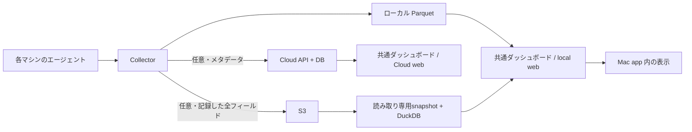

# 利用形態・保存先・画面の設計

決定日: 2026-09-09。保存と配布については architecture.md の旧方針より本書を優先する。

## ユースケース

| 目的 | 保存先 | 入口 |
|---|---|---|
| 1台の利用を外部に送らず分析する | ローカルの Parquet | Mac app / local web |
| 個人のMac・VM・CIを合算する | ローカル + Kikimimi Cloud の Personal | Cloud web / Mac app |
| チームの利用を集約する | ローカル + Kikimimi Cloud の team | Cloud web |
| 自分たちのS3でチームの利用を集約する | ローカル + S3 / S3互換ストレージ | 各メンバーのMac app / local webから共通S3を読む |

個人/チームは利用者と権限の軸。ローカル/Cloud/S3は保存の軸。
Mac app/local web/Cloud webは画面の軸であり、別々の分析製品にしない。
ローカル保存はブラウザの localStorage ではなく、Collector が管理するファイル。

## 責務とデータの流れ

- Collector はエージェントが動く環境ごとに必要。Cloud web 単体ではローカル活動を収集できない。
- Mac app はCollectorの導入・管理とローカル分析の入口。Cloud認証とチーム管理はMac app内のCloud画面またはブラウザで行う。
- ローカル分析はアカウント不要。収集停止後も保存済み履歴を読める。
- Cloud は複数マシンの集計と権限管理を担当する。ローカルと共通のReact分析画面を使う。
- S3の出力と読み取り接続は独立する。各メンバーがAWSの読取権限を使い、共通S3をMac app / local webで分析する。PostgreSQLとKikimimi Cloudアカウントは不要。権限はprefix単位のAWS権限で、Cloudのメンバー管理・行単位の閲覧制限は適用しない。

## 表示と設定（2026-09-09 改訂）

「保存先」「このMacの送信先」「このMacが読む接続」は別の状態である。
閲覧先変更を保存先変更として表示しない。閲覧操作で収集・アップロードを有効化しない。

| 画面 | 適用範囲 | 実際の操作 |
|---|---|---|
| App Settings | このMac | 収集・ログイン時起動・更新、実際のローカル保存先とCloud/S3送信設定の確認 |
| Workspace Settings | 選択中のワークスペース | 種別・権限の確認、Cloudのメンバー/招待管理への入口 |
| Viewing Connection | このMac × 選択中のワークスペース | 閲覧データソース・S3 bucket/prefix・AWS profile・endpointの保存と接続 |
| Dashboard | 閲覧中のデータ | 集計・フィルタ・スナップショット更新 |

App Settingsは常設ボタンと⌘,から開く。Workspace Settingsはワークスペースメニューから開く。
Viewing Connectionは右上のソース表示、Workspace SettingsとApp Settingsの接続管理から開く。
接続画面は常に「THIS MAC · VIEWING ONLY」と対象名を示す。AWS認証名は共有設定ではない。
設定画面でワークスペースを切り替えても設定の画面種別を維持し、対象名と内容を同時に更新する。
未設定S3は接続画面へ案内し、ローカルデータをチームデータとして表示しない。

PersonalはThis Mac・Personal Cloud・S3を閲覧できる。CloudチームはCloud、共有S3はS3を使用する。
CloudのorgとS3のbucketには共通チームIDがないため、同一のチーム設定として扱わない。
現時点のS3接続はこのMacだけに保存される。メンバーが同じbucket/prefixを設定し、AWS IAMでアクセスを管理する。
Cloudのメンバー管理は既存APIのowner/admin/member/viewer権限で制御する。
オーナーがチーム共通の保存先をCloud/S3間で変更する機能は未実装であり、変更できる設定として表示しない。
この機能を実装するときは共通のworkspace設定・権限API・端末への設定反映・既存データ移行方針を併せて実装する。

App Settingsの送信先は`/web/storage`から実設定を読み、閲覧中のデータソースから推測しない。
読取失敗は「不明」と表示して古い値を隠す。設定済みと同期成功は別の状態。
このAPIはCloudトークンや認証情報を返さない。送信設定の変更はApp SettingsのCollection、またはCLIで行う。
Cloudログイン済みであっても、端末のCloud送信が設定済みとは限らない。

MacアプリのCloud表示は権限を持たない別webviewで開く。メンバー管理への遷移先は固定のCloud URLに限定する。
ワークスペースを切り替える前にCloud APIが所属権限を確認し、接続失敗時は以前の確定済み設定を保持する。
ローカルWebのStorage & sharingはCollector実行環境の設定を表示する。
Cloud Webは端末設定を変更できない。Macアプリ内では端末設定リンクをApp Settingsへ、閲覧接続リンクをViewing Connectionへ案内する。

## 送信の境界

- ローカル保存は常に有効。CloudとS3はいずれも任意で、同時にも単独にも使える。
- 端末のCloud送信先は同時に1ワークスペース。Personalとteamへの同時送信は現段階の範囲外。
- team接続は `login --org <slug> --repo <glob>` で共有対象を接続前に設定できる。複数の `--repo` は許可リストを置き換える。省略は既存リストを維持する。
- `--org` は承認画面へのヒント。実際に承認された送信先を保存する。
- teamの空の許可リストは既存互換のため全リポジトリを許可する。画面と手順で明示する。Personalではこのフィルタは適用しない。
- S3は全リポジトリとローカルに記録された全フィールドを出力する。Cloudのマスクやteamの許可リストは適用しない。
- 新しい出力先の追加は既存Parquet全量の再送を意味しない。初回バックフィルや未処理のエージェントログが後から収集されることはある。

## 切替とオフライン

ログイン/ログアウトは稼働中Collectorに設定再読込を通知する。停止中なら次回起動時に反映する。
再読込は制御キューで処理されるため、処理中の送信を遡って取り消すものではない。
Cloudの送信待ちは接続先・org ID・共有ポリシー・host単位に分離する。
切替/解除時は旧宛先に送らずディスクに退避し、同じ宛先とポリシーに再接続した場合だけ再開する。
S3の送信待ちもバケット・エンドポイント・host単位に分離し、切替後のバケットへ混ぜない。
各キューは既存の容量上限を持つため、無期限の配送保証ではない。ローカル履歴は別に保持される。

旧バージョンの宛先情報がない `cloud-pending.jsonl` と `s3-staging/dt=*` は自動送信しない。
ファイルは削除せず残す。移行時に宛先を確認したうえで明示的な再送手段が必要であり、現段階では自動移行・再送UIはない。

## 実装段階と検証

1. ローカル: 共通ダッシュボード、閲覧範囲の表示、収集停止後の閲覧、アカウント不要。
2. Cloud: 既存のPersonal/team機能への導線、端末の送信先表示、ログイン反映、フィルタ付き初回接続、宛先間のキュー分離。
3. S3: 出力、宛先間のキュー分離に加えて、共通S3からの読み取り・複数端末集計・更新・ローカル表示への切替を提供する。

検証はローカルAPIの認証/秘密情報除外/読取失敗、Cloud切替とフィルタ、S3キュー分離、共通UIのローカル/Personal/team表示を対象とする。
実アカウントでの承認・複数マシン集約・チーム権限・実バケットへの到達性・署名済みMac appのE2Eは別途実環境で確認する。

S3はAWS CLI v2のList/Getのみで取得し、ローカルDuckDBで集計する。公開前に全ファイルを検証し、event_idを重複排除した不変snapshotへ切り替える。取得中のバージョン変更はETag条件付きGetで検知する。更新失敗時は旧snapshotと取得日時を残し、初回失敗は空データと扱わない。512 MiB・10,000オブジェクト・更新180秒を上限とし、超過は明示的なエラーにする。設定情報と一時キャッシュは閲覧端末内に置く。

チーム共通URL、ブラウザSSO、メンバー別の行権限、S3を直接走査する分散クエリエンジン、セルフホストのワンクリック運用は後続の範囲。詳しい利用手順とIAM例は [S3 dashboard](../src/content/docs/s3-dashboard.md) を参照。

## このMacの収集先切替（2026-09-09）

Workspaceは閲覧対象であり、閲覧操作で収集先を変更しない。
このMacのCollectorが実際に適用した宛先をWorkspaceの印に使用する。
別Workspaceの閲覧中は現在の収集先をバナー表示し、「Change collection…」からApp SettingsのCollectionへ案内する。
停止中・確認できない状態には収集中の印を付けない。既存CLIでCloud/S3を併用している場合は両宛先を表示する。

切替はApp Settingsだけで行う。保存先と共有範囲を確認してから、このMacのCloud/S3送信設定を一括で置き換える。
Cloudチームではリポジトリパターン、または明示的な全リポジトリ選択を必須にする。S3では全記録フィールド・全リポジトリが対象であると明示する。
ローカル履歴は維持する。既存ローカル履歴をこの操作だけでバックフィルしない。既存送信済みデータを削除しない。
停止中に保存しても自動的に収集を開始しない。

確認時の宛先と保存時の宛先が一致しない場合は切替を拒否する。
Cloud認証は固定のCloud device-code/activate/token APIで所属を検証し、tokenはnativeメモリとCLIの非公開stdinだけを通す。
CLIは検証完了後に設定をatomic saveし、Collectorへreloadを通知する。画面は設定保存を反映済みとは扱わず、Collectorの状態スナップショットが一致するまで反映待ちを表示する。
旧Collectorで適用先を確認できない場合も緑の印を推測で移さない。従来のローカル専用状態だけは、設定と状態が共にリモート宛先なしの場合に確認可能。
